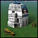

"Adv. Kbot Lab": Tech 2 Produces Kbots
----
<table align="right">
    <thead>
        <tr>
            <th align="left" colspan="2">
                Adv. Kbot Lab Tech 2 Produces Kbots
            </th>
        </tr>
    </thead>
    <tbody>
        <tr><td align="center" colspan="2">Note: Several units have stats defined at the start of the game based on the stats of others.</td></tr>
        <tr>
            <td align="right"><strong>Source:</strong></td>
            <td><a href="SCTATest">SCTATest</a></td>
        </tr>
        <tr>
            <td align="right"><strong>Unit ID:</strong></td>
            <td><code>coralab</code></td>
        </tr>
        <tr>
            <td align="right"><strong>Faction:</strong></td>
            <td>CORE</td>
        </tr>
        <tr>
            <td align="right"><strong>Tech level:</strong></td>
            <td> 2</td>
        </tr>
        <tr><td align="center" colspan="2"></td></tr>
        <tr>
            <td align="right"><strong>Health:</strong></td>
            <td> 3170</td>
        </tr>
        <tr>
            <td align="right"><strong>Armour:</strong></td>
            <td><code>Structure</code></td>
        </tr>
        <tr><td align="center" colspan="2"></td></tr>
        <tr>
            <td align="right"><strong>Energy cost:</strong></td>
            <td> 3625</td>
        </tr>
        <tr>
            <td align="right"><strong>Mass cost:</strong></td>
            <td> 1972</td>
        </tr>
        <tr>
            <td align="right"><strong>Build time:</strong></td>
            <td>14000</td>
        </tr>
        <tr>
            <td align="right"><strong>Build rate:</strong></td>
            <td> 200</td>
        </tr>
        <tr>
            <td align="right"><strong>Energy storage:</strong></td>
            <td> 200</td>
        </tr>
        <tr>
            <td align="right"><strong>Mass storage:</strong></td>
            <td> 200</td>
        </tr>
        <tr><td align="center" colspan="2"></td></tr>
        <tr>
            <td align="right"><strong>Vision radius:</strong></td>
            <td>14</td>
        </tr>
        <tr>
            <td align="right"><strong>Water vision radius:</strong></td>
            <td>10</td>
        </tr>
        <tr><td align="center" colspan="2"></td></tr>
        <tr><td align="center" colspan="2"></td></tr>
        <tr>
            <td align="right"><strong>Weapons:</strong></td>
            <td>1 (<a href="#weapons">Details</a>)</td>
        </tr>
    </tbody>
</table>

"Adv. Kbot Lab" is a CORE structure unit included in *SCTATest*.
It is classified as a tech 2 produces kbots unit. It has no defined build description, and no categories to define common builders.

Contents

1. – <a href="#construction">Construction</a>
2. – <a href="#order-capabilities">Order capabilities</a>
3. – <a href="#engineering">Engineering</a>
4. – <a href="#weapons">Weapons</a>

### Construction
Build times from hard coded builders on the Steam/retail version of the game:
*  02:55 ‒  21/s ‒  11/s — Built by <a href="CORCK">Tech 1 Tech Level 1</a>

### Order capabilities
The following orders can be issued to the unit:
<table>
<td></td>
<td></td>
<td></td>
<td></td>
<td></td>
<tr>
<td></td>
</table>

### Engineering
It has the build category <code>BOT MOBILE TECH2 CORE</code>. 

This build category allows it to build the following mod units:

<table>
    <tr>
        <td rowspan="2"></td>
        <td></td>
        <td></td>
        <td></td>
        <td></td>
        <td></td>
        <td></td>
        <td></td>
        <td></td>
    </tr>
    <tr>
        <td></td>
        <td></td>
        <td></td>
        <td></td>
        <td></td>
        <td></td>
    </tr>
</table>

### Weapons

DeathWeapon

    <table>
        <tr>
            <td align="right"><strong>Damage:</strong></td>
            <td>200</td>
        </tr>
        <tr>
            <td align="right"><strong>Damage radius:</strong></td>
            <td>5</td>
        </tr>
        <tr>
            <td align="right"><strong>Damage type:</strong></td>
            <td><code>Normal</code></td>
        </tr>
        <tr>
            <td align="right"><strong>Flags:</strong></td>
            <td>Damage friendly</td>
        </tr>
    </table>

<table align=center>
<td>Categories : <a href="_categories.CORE">CORE</a> · <a href="_categories.TECH2">TECH2</a> · <a href="_categories.LAND">LAND</a> · <a href="_categories.FACTORY">FACTORY</a> · <a href="_categories.STRUCTURE">STRUCTURE</a>
