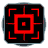

"Turtle": Tech 3 Hover Transport
----
<table align="right">
    <thead>
        <tr>
            <th align="left" colspan="2">
                Turtle Tech 3 Hover Transport
            </th>
        </tr>
    </thead>
    <tbody>
        <tr><td align="center" colspan="2">Note: Several units have stats defined at the start of the game based on the stats of others.</td></tr>
        <tr>
            <td align="right"><strong>Source:</strong></td>
            <td><a href="SCTATest">SCTATest</a></td>
        </tr>
        <tr>
            <td align="right"><strong>Unit ID:</strong></td>
            <td><code>corthovr</code></td>
        </tr>
        <tr>
            <td align="right"><strong>Faction:</strong></td>
            <td>CORE</td>
        </tr>
        <tr>
            <td align="right"><strong>Tech level:</strong></td>
            <td> 3</td>
        </tr>
        <tr><td align="center" colspan="2"></td></tr>
        <tr>
            <td align="right"><strong>Health:</strong></td>
            <td> 1080</td>
        </tr>
        <tr>
            <td align="right"><strong>Armour:</strong></td>
            <td><code>Normal</code></td>
        </tr>
        <tr><td align="center" colspan="2"></td></tr>
        <tr>
            <td align="right"><strong>Energy cost:</strong></td>
            <td> 7500</td>
        </tr>
        <tr>
            <td align="right"><strong>Mass cost:</strong></td>
            <td> 650</td>
        </tr>
        <tr>
            <td align="right"><strong>Build time:</strong></td>
            <td>19500</td>
        </tr>
        <tr><td align="center" colspan="2"></td></tr>
        <tr>
            <td align="right"><strong>Vision radius:</strong></td>
            <td>18</td>
        </tr>
        <tr>
            <td align="right"><strong>Water vision radius:</strong></td>
            <td>6</td>
        </tr>
        <tr><td align="center" colspan="2"></td></tr>
        <tr>
            <td align="right"><strong>Motion type:</strong></td>
            <td><code>RULEUMT_Hover</code></td>
        </tr>
        <tr>
            <td align="right"><strong>Movement speed:</strong></td>
            <td>3</td>
        </tr>
        <tr><td align="center" colspan="2"></td></tr>
        <tr>
            <td align="right"><strong>Weapons:</strong></td>
            <td>1 (<a href="#weapons">Details</a>)</td>
        </tr>
    </tbody>
</table>

"Turtle" is a CORE hover unit included in *SCTATest*.
It is classified as a tech 3 hover transport unit. It has no defined build description, and no categories to define common builders.

Contents

1. – <a href="#abilities">Abilities</a>
2. – <a href="#construction">Construction</a>
3. – <a href="#order-capabilities">Order capabilities</a>
4. – <a href="#transport-capacity">Transport capacity</a>
5. – <a href="#weapons">Weapons</a>

### Abilities
Hover over abilities to see effect descriptions.

* Hover
* Transport

### Construction
Build times from hard coded builders on the Steam/retail version of the game:
*  01:37 ‒  77/s ‒  7/s — Built by <a href="CORHP">Tech 2 Builds Hovercraft</a>

### Order capabilities
The following orders can be issued to the unit:
<table>
<td></td>
<td></td>
<td></td>
<td></td>
<td></td>
<td></td>
<tr>
<td></td>
</table>

### Transport capacity
This unit has 12 small attach points, 6 medium attach points, and 4 large attach points. Using an attach point that isn't small costs a number of small attach points. Specifically 2 for medium, and 4 for large. Due to these costs, not all large attach points can be used concurrently; at most 3 of them could be used at a given time, and the physical layout of them may reduce that number further.

### Weapons

DeathWeapon

    <table>
        <tr>
            <td align="right"><strong>Damage:</strong></td>
            <td>50</td>
        </tr>
        <tr>
            <td align="right"><strong>Damage radius:</strong></td>
            <td>3</td>
        </tr>
        <tr>
            <td align="right"><strong>Damage type:</strong></td>
            <td><code>Normal</code></td>
        </tr>
        <tr>
            <td align="right"><strong>Flags:</strong></td>
            <td>Damage friendly</td>
        </tr>
    </table>

<table align=center>
<td>Categories : <a href="_categories.CORE">CORE</a> · <a href="_categories.TECH3">TECH3</a> · <a href="_categories.MOBILE">MOBILE</a> · <a href="_categories.LAND">LAND</a> · <a href="_categories.HOVER">HOVER</a> · <a href="_categories.TRANSPORTATION">TRANSPORTATION</a>
