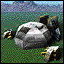
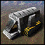
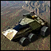
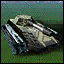
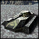
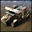
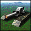
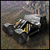

"Vehicle Plant": Tech 1 Produces Vehicles
----
<table align="right">
    <thead>
        <tr>
            <th align="left" colspan="2">
                Vehicle Plant Tech 1 Produces Vehicles
            </th>
        </tr>
    </thead>
    <tbody>
        <tr><td align="center" colspan="2">Note: Several units have stats defined at the start of the game based on the stats of others.</td></tr>
        <tr>
            <td align="right"><strong>Source:</strong></td>
            <td><a href="SCTATest">SCTATest</a></td>
        </tr>
        <tr>
            <td align="right"><strong>Unit ID:</strong></td>
            <td><code>corvp</code></td>
        </tr>
        <tr>
            <td align="right"><strong>Faction:</strong></td>
            <td>CORE</td>
        </tr>
        <tr>
            <td align="right"><strong>Tech level:</strong></td>
            <td> 1</td>
        </tr>
        <tr><td align="center" colspan="2"></td></tr>
        <tr>
            <td align="right"><strong>Health:</strong></td>
            <td> 2550</td>
        </tr>
        <tr>
            <td align="right"><strong>Armour:</strong></td>
            <td><code>Structure</code></td>
        </tr>
        <tr><td align="center" colspan="2"></td></tr>
        <tr>
            <td align="right"><strong>Energy cost:</strong></td>
            <td> 1100</td>
        </tr>
        <tr>
            <td align="right"><strong>Mass cost:</strong></td>
            <td> 600</td>
        </tr>
        <tr>
            <td align="right"><strong>Build time:</strong></td>
            <td>6700 (<a href="#construction">Details</a>)</td>
        </tr>
        <tr>
            <td align="right"><strong>Build rate:</strong></td>
            <td> 100</td>
        </tr>
        <tr>
            <td align="right"><strong>Energy storage:</strong></td>
            <td> 50</td>
        </tr>
        <tr>
            <td align="right"><strong>Mass storage:</strong></td>
            <td> 50</td>
        </tr>
        <tr><td align="center" colspan="2"></td></tr>
        <tr>
            <td align="right"><strong>Vision radius:</strong></td>
            <td>14</td>
        </tr>
        <tr>
            <td align="right"><strong>Water vision radius:</strong></td>
            <td>10</td>
        </tr>
        <tr><td align="center" colspan="2"></td></tr>
        <tr><td align="center" colspan="2"></td></tr>
        <tr>
            <td align="right"><strong>Weapons:</strong></td>
            <td>1 (<a href="#weapons">Details</a>)</td>
        </tr>
    </tbody>
</table>

"Vehicle Plant" is a CORE structure unit included in *SCTATest*.
It is classified as a tech 1 produces vehicles unit. It has no defined build description.<error:buildable unit with no build description>

Contents

1. – <a href="#construction">Construction</a>
2. – <a href="#order-capabilities">Order capabilities</a>
3. – <a href="#engineering">Engineering</a>
4. – <a href="#weapons">Weapons</a>

### Construction
Build times from hard coded builders on the Steam/retail version of the game:
*  01:07 ‒  16/s ‒  9/s — Built by <a href="CORCV">Tech 1 Tech Level 1</a>
*  01:29 ‒  12/s ‒  7/s — Built by <a href="CORCA">Tech 1 Tech Level 1</a>
*  01:23 ‒  13/s ‒  7/s — Built by <a href="CORCK">Tech 1 Tech Level 1</a>
*  00:53 ‒  21/s ‒  11/s — Built by <a href="CORCS">Tech 1 Tech Level 1</a>
*  00:33 ‒  33/s ‒  18/s — Built by <a href="CORACV">Tech 2 Tech Level 2</a>
*  03:43 ‒  5/s ‒  3/s — Built by <a href="CORDECOM">Tech 2 Commander</a>
*  01:23 ‒  13/s ‒  7/s — Built by <a href="CORCH">Tech 3 Tech Level 3</a>
*  02:14 ‒  8/s ‒  4/s — Built by <a href="CORCSA">Tech 3 Tech Level 3</a>
*  11:10 ‒  2/s ‒  1/s — Built by Armoured Command Unit
*  03:43 ‒  5/s ‒  3/s — Built by Tech 2 Armoured Command Unit
*  22:20 ‒  1/s ‒  0/s — Built by Tech 1 Engineer
*  07:26 ‒  2/s ‒  1/s — Built by Tech 3 Engineer
*  05:35 ‒  3/s ‒  2/s — Built by Tech 1 Factory

### Order capabilities
The following orders can be issued to the unit:
<table>
<td></td>
<td></td>
<td></td>
<td></td>
<td></td>
<tr>
<td></td>
</table>

### Engineering
It has the build category <code>TANK MOBILE TECH1 CORE</code>. 

This build category allows it to build the following mod units:

<table>
    <tr>
        <td></td>
        <td></td>
        <td></td>
        <td></td>
        <td></td>
        <td></td>
        <td></td>
        <td></td>
    </tr>
</table>

### Weapons

DeathWeapon

    <table>
        <tr>
            <td align="right"><strong>Damage:</strong></td>
            <td>200</td>
        </tr>
        <tr>
            <td align="right"><strong>Damage radius:</strong></td>
            <td>5</td>
        </tr>
        <tr>
            <td align="right"><strong>Damage type:</strong></td>
            <td><code>Normal</code></td>
        </tr>
        <tr>
            <td align="right"><strong>Flags:</strong></td>
            <td>Damage friendly</td>
        </tr>
    </table>

<table align=center>
<td>Categories : <a href="_categories.CORE">CORE</a> · <a href="_categories.TECH1">TECH1</a> · <a href="_categories.LAND">LAND</a> · <a href="_categories.FACTORY">FACTORY</a> · <a href="_categories.STRUCTURE">STRUCTURE</a>
