Units with the <code>STRUCTURE</code> category.
<table>
    <tr>
        <td><a href="ARMAP">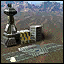</a></td>
        <td><code>armap</code></td>
        <td></td>
        <td><a href="ARMAP">Aircraft Plant: Tech 1 Produces Aircraft</a></td>
    </tr>
    <tr>
        <td><a href="ARMDRAG">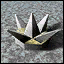</a></td>
        <td><code>armdrag</code></td>
        <td></td>
        <td><a href="ARMDRAG">Dragons Teeth: Tech 1 Perimeter Defence</a></td>
    </tr>
    <tr>
        <td><a href="ARMESTOR">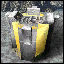</a></td>
        <td><code>armestor</code></td>
        <td></td>
        <td><a href="ARMESTOR">Energy Storage: Tech 1 Increases Energy Storage</a></td>
    </tr>
    <tr>
        <td><a href="ARMGEO">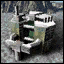</a></td>
        <td><code>armgeo</code></td>
        <td></td>
        <td><a href="ARMGEO">Geothermal Powerplant: Tech 1 Produces Energy</a></td>
    </tr>
    <tr>
        <td><a href="ARMLAB">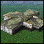</a></td>
        <td><code>armlab</code></td>
        <td></td>
        <td><a href="ARMLAB">Kbot Lab: Tech 1 Produces Kbots</a></td>
    </tr>
    <tr>
        <td><a href="ARMMAKR">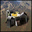</a></td>
        <td><code>armmakr</code></td>
        <td></td>
        <td><a href="ARMMAKR">Metal Maker: Tech 1 Converts Energy into Metal</a></td>
    </tr>
    <tr>
        <td><a href="ARMMEX">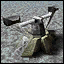</a></td>
        <td><code>armmex</code></td>
        <td></td>
        <td><a href="ARMMEX">Metal Extractor: Tech 1 Extracts Metal</a></td>
    </tr>
    <tr>
        <td><a href="ARMMSTOR">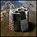</a></td>
        <td><code>armmstor</code></td>
        <td></td>
        <td><a href="ARMMSTOR">Metal Storage: Tech 1 Increases Metal Storage</a></td>
    </tr>
    <tr>
        <td><a href="ARMRAD">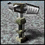</a></td>
        <td><code>armrad</code></td>
        <td></td>
        <td><a href="ARMRAD">Radar Tower: Tech 1 Radar Tower</a></td>
    </tr>
    <tr>
        <td><a href="ARMRL">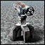</a></td>
        <td><code>armrl</code></td>
        <td></td>
        <td><a href="ARMRL">Defender: Tech 1 Missile Tower</a></td>
    </tr>
    <tr>
        <td><a href="ARMSONAR">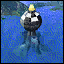</a></td>
        <td><code>armsonar</code></td>
        <td></td>
        <td><a href="ARMSONAR">Sonar Station: Tech 1 Locates Water Units</a></td>
    </tr>
    <tr>
        <td><a href="ARMSY">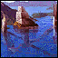</a></td>
        <td><code>armsy</code></td>
        <td></td>
        <td><a href="ARMSY">Shipyard: Tech 1 Produces Ships</a></td>
    </tr>
    <tr>
        <td><a href="ARMTIDE">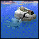</a></td>
        <td><code>armtide</code></td>
        <td></td>
        <td><a href="ARMTIDE">Tidal Generator: Tech 1 Produces Energy</a></td>
    </tr>
    <tr>
        <td><a href="ARMTL">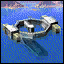</a></td>
        <td><code>armtl</code></td>
        <td></td>
        <td><a href="ARMTL">Torpedo Launcher: Tech 1 Torpedo Launcher</a></td>
    </tr>
    <tr>
        <td><a href="ARMVP">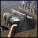</a></td>
        <td><code>armvp</code></td>
        <td></td>
        <td><a href="ARMVP">Vehicle Plant: Tech 1 Produces Vehicles</a></td>
    </tr>
    <tr>
        <td><a href="CORAP">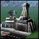</a></td>
        <td><code>corap</code></td>
        <td></td>
        <td><a href="CORAP">Aircraft Plant: Tech 1 Produces Aircraft</a></td>
    </tr>
    <tr>
        <td><a href="CORDRAG">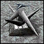</a></td>
        <td><code>cordrag</code></td>
        <td></td>
        <td><a href="CORDRAG">Dragons Teeth: Tech 1 Perimeter Defence</a></td>
    </tr>
    <tr>
        <td><a href="CORESTOR">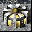</a></td>
        <td><code>corestor</code></td>
        <td></td>
        <td><a href="CORESTOR">Energy Storage: Tech 1 Increases Energy Storage</a></td>
    </tr>
    <tr>
        <td><a href="CORGEO">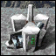</a></td>
        <td><code>corgeo</code></td>
        <td></td>
        <td><a href="CORGEO">Geothermal Powerplant: Tech 1 Produces Energy</a></td>
    </tr>
    <tr>
        <td><a href="CORLAB">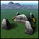</a></td>
        <td><code>corlab</code></td>
        <td></td>
        <td><a href="CORLAB">Kbot Lab: Tech 1 Produces Kbots</a></td>
    </tr>
    <tr>
        <td><a href="CORMAKR">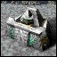</a></td>
        <td><code>cormakr</code></td>
        <td></td>
        <td><a href="CORMAKR">Metal Maker: Tech 1 Metal Maker</a></td>
    </tr>
    <tr>
        <td><a href="CORMEX">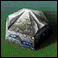</a></td>
        <td><code>cormex</code></td>
        <td></td>
        <td><a href="CORMEX">Metal Extractor: Tech 1 Extracts Metal</a></td>
    </tr>
    <tr>
        <td><a href="CORMSTOR">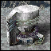</a></td>
        <td><code>cormstor</code></td>
        <td></td>
        <td><a href="CORMSTOR">Metal Storage: Tech 1 Increases Metal Storage</a></td>
    </tr>
    <tr>
        <td><a href="CORRAD">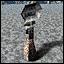</a></td>
        <td><code>corrad</code></td>
        <td></td>
        <td><a href="CORRAD">Radar Tower: Tech 1 Radar Tower</a></td>
    </tr>
    <tr>
        <td><a href="CORRL">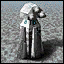</a></td>
        <td><code>corrl</code></td>
        <td></td>
        <td><a href="CORRL">Pulverizer: Tech 1 Missile Tower</a></td>
    </tr>
    <tr>
        <td><a href="CORSONAR">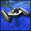</a></td>
        <td><code>corsonar</code></td>
        <td></td>
        <td><a href="CORSONAR">Sonar Station: Tech 1 Sonar Station</a></td>
    </tr>
    <tr>
        <td><a href="CORSY">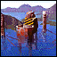</a></td>
        <td><code>corsy</code></td>
        <td></td>
        <td><a href="CORSY">Shipyard: Tech 1 Produces Ships</a></td>
    </tr>
    <tr>
        <td><a href="CORTIDE">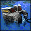</a></td>
        <td><code>cortide</code></td>
        <td></td>
        <td><a href="CORTIDE">Tidal Generator: Tech 1 Produces Energy</a></td>
    </tr>
    <tr>
        <td><a href="CORTL">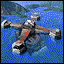</a></td>
        <td><code>cortl</code></td>
        <td></td>
        <td><a href="CORTL">Torpedo Launcher: Tech 1 Torpedo Launcher</a></td>
    </tr>
    <tr>
        <td></td>
        <td><code>corvp</code></td>
        <td></td>
        <td><a href="CORVP">Vehicle Plant: Tech 1 Produces Vehicles</a></td>
    </tr>
    <tr>
        <td><a href="ARMAAP">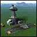</a></td>
        <td><code>armaap</code></td>
        <td></td>
        <td><a href="ARMAAP">Adv. Aircraft Plant: Tech 2 Produces Aircraft</a></td>
    </tr>
    <tr>
        <td><a href="ARMALAB">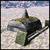</a></td>
        <td><code>armalab</code></td>
        <td></td>
        <td><a href="ARMALAB">Adv. Kbot Lab: Tech 2 Produces Kbots</a></td>
    </tr>
    <tr>
        <td><a href="ARMASY">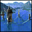</a></td>
        <td><code>armasy</code></td>
        <td></td>
        <td><a href="ARMASY">Adv. Shipyard: Tech 2 Produces Ships</a></td>
    </tr>
    <tr>
        <td><a href="ARMATL">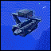</a></td>
        <td><code>armatl</code></td>
        <td></td>
        <td><a href="ARMATL">Advanced Torpedo Launcher: Tech 2 Advanced Torpedo Launcher</a></td>
    </tr>
    <tr>
        <td><a href="ARMAVP">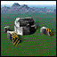</a></td>
        <td><code>armavp</code></td>
        <td></td>
        <td><a href="ARMAVP">Adv. Vehicle Plant: Tech 2 Produces Vehicles</a></td>
    </tr>
    <tr>
        <td></td>
        <td><code>armemp</code></td>
        <td></td>
        <td><a href="ARMEMP">Stunner: Tech 2 EMP Missile Launcher</a></td>
    </tr>
    <tr>
        <td><a href="ARMFUS">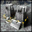</a></td>
        <td><code>armfus</code></td>
        <td></td>
        <td><a href="ARMFUS">Fusion Reactor: Tech 2 Produces Energy</a></td>
    </tr>
    <tr>
        <td><a href="ARMGUARD">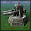</a></td>
        <td><code>armguard</code></td>
        <td></td>
        <td><a href="ARMGUARD">Guardian: Tech 2 Plasma Battery</a></td>
    </tr>
    <tr>
        <td><a href="ARMHLT">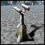</a></td>
        <td><code>armhlt</code></td>
        <td></td>
        <td><a href="ARMHLT">Sentinel: Tech 2 Heavy Laser Tower</a></td>
    </tr>
    <tr>
        <td><a href="ARMHP">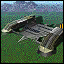</a></td>
        <td><code>armhp</code></td>
        <td></td>
        <td><a href="ARMHP">Hovercraft Platform: Tech 2 Builds Hovercraft</a></td>
    </tr>
    <tr>
        <td><a href="ARMMOHO">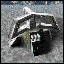</a></td>
        <td><code>armmoho</code></td>
        <td></td>
        <td><a href="ARMMOHO">Moho Mine: Tech 2 Advanced Metal Extractor</a></td>
    </tr>
    <tr>
        <td><a href="CORAAP">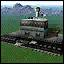</a></td>
        <td><code>coraap</code></td>
        <td></td>
        <td><a href="CORAAP">Adv. Aircraft Plant: Tech 2 Produces Aircraft</a></td>
    </tr>
    <tr>
        <td></td>
        <td><code>coralab</code></td>
        <td></td>
        <td><a href="CORALAB">Adv. Kbot Lab: Tech 2 Produces Kbots</a></td>
    </tr>
    <tr>
        <td><a href="CORASY">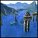</a></td>
        <td><code>corasy</code></td>
        <td></td>
        <td><a href="CORASY">Adv. Shipyard: Tech 2 Produces Ships</a></td>
    </tr>
    <tr>
        <td><a href="CORATL">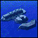</a></td>
        <td><code>coratl</code></td>
        <td></td>
        <td><a href="CORATL">Advanced Torpedo Launcher: Tech 2 Advanced Torpedo Launcher</a></td>
    </tr>
    <tr>
        <td><a href="CORAVP">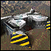</a></td>
        <td><code>coravp</code></td>
        <td></td>
        <td><a href="CORAVP">Adv. Vehicle Plant: Tech 2 Produces Vehicles</a></td>
    </tr>
    <tr>
        <td><a href="CORFHLT">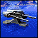</a></td>
        <td><code>corfhlt</code></td>
        <td></td>
        <td><a href="CORFHLT">Thunderbolt: Tech 2 Heavy Laser Tower</a></td>
    </tr>
    <tr>
        <td><a href="CORFUS">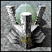</a></td>
        <td><code>corfus</code></td>
        <td></td>
        <td><a href="CORFUS">Fusion Power Plant: Tech 2 Produces Energy</a></td>
    </tr>
    <tr>
        <td><a href="CORHP">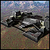</a></td>
        <td><code>corhp</code></td>
        <td></td>
        <td><a href="CORHP">Hovercraft Platform: Tech 2 Builds Hovercraft</a></td>
    </tr>
    <tr>
        <td><a href="CORMOHO">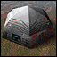</a></td>
        <td><code>cormoho</code></td>
        <td></td>
        <td><a href="CORMOHO">Moho Mine: Tech 2 Advanced Metal Extractor</a></td>
    </tr>
    <tr>
        <td><a href="CORPUN">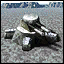</a></td>
        <td><code>corpun</code></td>
        <td></td>
        <td><a href="CORPUN">Punisher: Tech 2 Plasma Battery</a></td>
    </tr>
    <tr>
        <td><a href="CORTRON">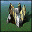</a></td>
        <td><code>cortron</code></td>
        <td></td>
        <td><a href="CORTRON">Neutron: Tech 2 Tactical Nuke Launcher</a></td>
    </tr>
    <tr>
        <td><a href="CORVIPE">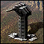</a></td>
        <td><code>corvipe</code></td>
        <td></td>
        <td><a href="CORVIPE">Viper: Tech 2 Pop-up Laser Cannon</a></td>
    </tr>
    <tr>
        <td></td>
        <td><code>mine1</code></td>
        <td></td>
        <td><a href="MINE1">Tiny: Tech 2 Low Damage, Med. Range Mine</a></td>
    </tr>
    <tr>
        <td></td>
        <td><code>mine2</code></td>
        <td></td>
        <td><a href="MINE2">Area Mine: Tech 2 Medium Damage, Small Range Mine</a></td>
    </tr>
    <tr>
        <td></td>
        <td><code>mine3</code></td>
        <td></td>
        <td><a href="MINE3">Focused Mine: Tech 2 Med. Damage, Medium Range Mine</a></td>
    </tr>
    <tr>
        <td></td>
        <td><code>mine4</code></td>
        <td></td>
        <td><a href="MINE4">Precision Mine: Tech 2 High Damage, Small Range Mine</a></td>
    </tr>
    <tr>
        <td></td>
        <td><code>armamb</code></td>
        <td></td>
        <td><a href="ARMAMB">Ambusher: Tech 3 Pop-up Heavy Cannon</a></td>
    </tr>
    <tr>
        <td></td>
        <td><code>armamd</code></td>
        <td></td>
        <td><a href="ARMAMD">Protector: Tech 3 Anti Missile Defense System</a></td>
    </tr>
    <tr>
        <td></td>
        <td><code>armanni</code></td>
        <td></td>
        <td><a href="ARMANNI">Annihilator: Tech 3 Energy Weapon</a></td>
    </tr>
    <tr>
        <td></td>
        <td><code>armarad</code></td>
        <td></td>
        <td><a href="ARMARAD">Advanced Radar Tower: Tech 3 Long Range Radar Tower</a></td>
    </tr>
    <tr>
        <td></td>
        <td><code>armason</code></td>
        <td></td>
        <td><a href="ARMASON">Advanced Sonar Station: Tech 3 Extended Sonar</a></td>
    </tr>
    <tr>
        <td></td>
        <td><code>armasp</code></td>
        <td></td>
        <td><a href="ARMASP">Air Repair Pad: Tech 3 Automatically repairs aircraft</a></td>
    </tr>
    <tr>
        <td></td>
        <td><code>armckfus</code></td>
        <td></td>
        <td><a href="ARMCKFUS">Cloakable Fusion Reactor: Tech 3 Produces Energy</a></td>
    </tr>
    <tr>
        <td></td>
        <td><code>armflak</code></td>
        <td></td>
        <td><a href="ARMFLAK">Flakker: Tech 3 Anti-Air Flak Gun</a></td>
    </tr>
    <tr>
        <td></td>
        <td><code>armmmkr</code></td>
        <td></td>
        <td><a href="ARMMMKR">Moho Metal Maker: Tech 3 Converts Energy into Metal</a></td>
    </tr>
    <tr>
        <td></td>
        <td><code>armplat</code></td>
        <td></td>
        <td><a href="ARMPLAT">Seaplane Platform: Tech 3 Builds Seaplanes</a></td>
    </tr>
    <tr>
        <td></td>
        <td><code>armsilo</code></td>
        <td></td>
        <td><a href="ARMSILO">Retaliator: Tech 3 Nuclear Missile Launcher</a></td>
    </tr>
    <tr>
        <td></td>
        <td><code>corarad</code></td>
        <td></td>
        <td><a href="CORARAD">Advanced Radar Tower: Tech 3 Long Range Radar Tower</a></td>
    </tr>
    <tr>
        <td></td>
        <td><code>corason</code></td>
        <td></td>
        <td><a href="CORASON">Advanced Sonar Station: Tech 3 Extended Sonar</a></td>
    </tr>
    <tr>
        <td></td>
        <td><code>corasp</code></td>
        <td></td>
        <td><a href="CORASP">Air Repair Pad: Tech 3 Automatically repairs aircraft</a></td>
    </tr>
    <tr>
        <td></td>
        <td><code>corckfus</code></td>
        <td></td>
        <td><a href="CORCKFUS">Cloakable Fusion Reactor: Tech 3 Produces Energy</a></td>
    </tr>
    <tr>
        <td></td>
        <td><code>cordoom</code></td>
        <td></td>
        <td><a href="CORDOOM">Doomsday Machine: Tech 3 Energy Weapon</a></td>
    </tr>
    <tr>
        <td></td>
        <td><code>corflak</code></td>
        <td></td>
        <td><a href="CORFLAK">Cobra: Tech 3 Anti-Air Flak Gun</a></td>
    </tr>
    <tr>
        <td></td>
        <td><code>corfmd</code></td>
        <td></td>
        <td><a href="CORFMD">Fortitude Missile Defense: Tech 3 Anti Missile Defense System</a></td>
    </tr>
    <tr>
        <td></td>
        <td><code>corint</code></td>
        <td></td>
        <td><a href="CORINT">Intimidator: Tech 3 Long Range Plasma Cannon</a></td>
    </tr>
    <tr>
        <td></td>
        <td><code>cormmkr</code></td>
        <td></td>
        <td><a href="CORMMKR">Moho Metal Maker: Tech 3 Converts Energy into Metal</a></td>
    </tr>
    <tr>
        <td></td>
        <td><code>corplat</code></td>
        <td></td>
        <td><a href="CORPLAT">Seaplane Platform: Tech 3 Builds Seaplanes</a></td>
    </tr>
    <tr>
        <td></td>
        <td><code>corsilo</code></td>
        <td></td>
        <td><a href="CORSILO">Silencer: Tech 3 Nuclear Missile Launcher</a></td>
    </tr>
    <tr>
        <td></td>
        <td><code>cortoast</code></td>
        <td></td>
        <td><a href="CORTOAST">Toaster: Tech 3 Pop-up Heavy Cannon</a></td>
    </tr>
    <tr>
        <td></td>
        <td><code>armvulc</code></td>
        <td></td>
        <td><a href="ARMVULC">Vulcan: Rapid Fire Plasma Cannon</a></td>
    </tr>
    <tr>
        <td></td>
        <td><code>corbuzz</code></td>
        <td></td>
        <td><a href="CORBUZZ">Buzzsaw: Rapid Fire Plasma Cannon</a></td>
    </tr>
    <tr>
        <td></td>
        <td><code>corgant</code></td>
        <td></td>
        <td><a href="CORGANT">Krogoth Gantry: Builds Krogoths</a></td>
    </tr>
</table>
